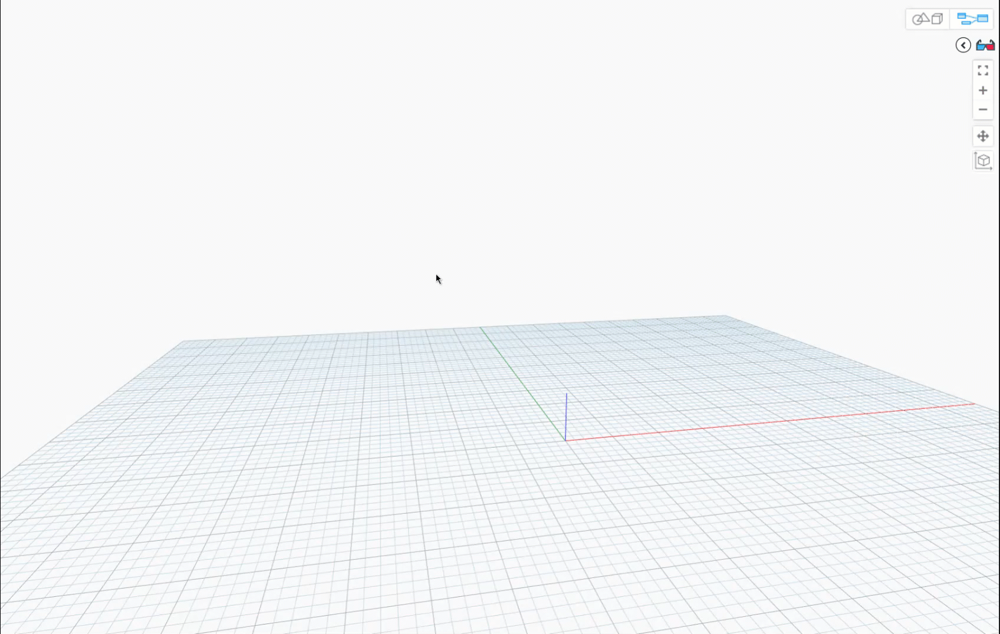

# DynamoPython

Repository of code snippets for use within ***[Autodesk's Dynamo for Revit](https://dynamobim.org/)***.

This repo is a collection of about 80+ Python scripts meant to be run within Dynamo.

It is a labor of love which has saved me and others countless hours throughout the years. More scripts will keep getting added as the need for them arises. If you'd like to propose new scripts or find that one or more are broken, please don't hesitate to open an 'Issue' so it can be fixed or added. Hope you enjoy!

## How To Use

1. **Open Autodesk Revit**  
   Launch the version of *[Autodesk Revit](https://www.autodesk.com/products/revit/architecture)* you want to work with.

   

2. **Open Dynamo**  
   In Revit, go to the *"Manage"* tab and click on the *"Dynamo"* button to open the Dynamo visual programming environment.

   

3. **Create a New Dynamo Workspace**  
   Once Dynamo opens, click *"New"* to start a new workspace.

   

4. **Add a Python Script Node**  
   In the Dynamo workspace, right-click and search for "Python Script" or find it in the "Script" section of the library. Drag the "Python Script" node onto the canvas.

   

5. **Copy a Script from This Repository**  
   Browse this repository and open the Python script you want to use. Copy its contents.

6. **Paste the Script into the Python Node**  
   Double-click the Python Script node in Dynamo to open the code editor. Paste the copied script into the editor window.

      

7. **Connect Inputs (if needed)**  
   If the script requires inputs, connect the appropriate nodes to the Python node's input ports.

   

8. **Run the Script**  
   Click the "Run" button in Dynamo to execute the script. Observe the results in Dynamo and/or Revit.

You're all set! Repeat the process for any other scripts

## Helpful Tips

- When encountered with the following comment within a script, refer to the boilerplate code in [dyn_template_boilerplate](dyn_template_boilerplate.py) file at the root of this repository and copy what you need from there.

```python
###### BOILERPLATE CODE GOES HERE ######
```

## Resources

- *[Dynamo Primer](https://primer2.dynamobim.org/)*
- *[Dynamo Docs](https://help.autodesk.com/view/RVT/2024/ENU/?guid=RevitDynamo_Dynamo_for_Revit_html)*
- *[Revit API Docs](https://www.revitapidocs.com/)*